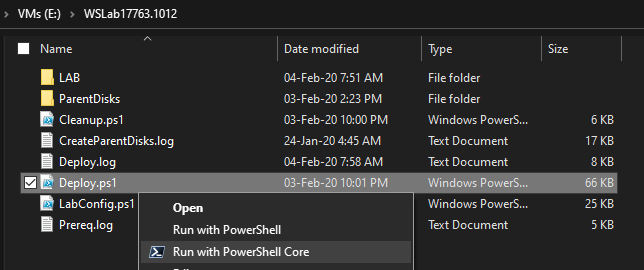

# WSLab

## tl;dr

To start using WSLab just download the latest version of scrips from [Releases](https://github.com/microsoft/WSLab/releases) section of this repository.

💡 Shortcut to the latest version is https://aka.ms/wslab/download

<p align="center">
<a href="https://aka.ms/wslab/download"></a>
</p>

## Introduction

<!-- TOC -->

- [WSLab](#wslab)
    - [tl;dr](#tldr)
    - [Introduction](#introduction)
    - [Requirements](#requirements)
    - [Scripts](#scripts)
    - [Data Collection](#data-collection)
        - [How to get the Scripts](#how-to-get-the-scripts)
    - [Scenarios](#scenarios)
    - [Use cases](#use-cases)
        - [Prototyping](#prototyping)
        - [Hands on Labs](#hands-on-labs)
        - [Issue reproduction](#issue-reproduction)
        - [Sessions](#sessions)
        - [Run in PowerShell Core 7](#run-in-powershell-core-7)

<!-- /TOC -->

WSLab is a GitHub project that aims to provide virtual environments in Hyper-V, that can be built in consistent way. It comes at no additional cost, it's free and available under the [MIT License](License).

Unlike other solutions, WSLab focuses on simplicity (all actions can be done without typing complex scripts) and low profile (all disks are differencing, minimum requirements are 8GB RAM and 40GB free space). There is no special hardware requirement. WSLab can run on almost any machine that has SSD and decent amount of memory.


## Requirements

* Windows 10 Pro/Enterprise (as Hyper-V is required) or Windows Server 2016/2019
* 8GB RAM
* CPU with Virtualization support
* SSD
* 40GB free space

## Scripts

The main part of WSLab are the [Scripts](https://aka.ms/wslabzip) that will help you preparing lab files ([Hydration Phase](Docs/wslab-hydration.md)). This phase is the most time consuming (1-2hours), but needs to be done only once. It will create virtual hard disks from of provided ISO and will create Domain Controller. [WSLab Deployment](Docs/wslab-deployment.md) takes only few minutes as it will just import Domain Controller and will add other Virtual Machines as specified in LabConfig.ps1


## Data Collection

The software may collect information about you and your use of the software and send it to Microsoft. Microsoft may use this information to provide services and improve our products and services. You may turn off the telemetry as [described in the repository](http://aka.ms/wslab/telemetry). There are also some features in the software that may enable you and Microsoft to collect data from users of your applications. If you use these features, you must comply with applicable law, including providing appropriate notices to users of your applications together with a copy of Microsoft's privacy statement. Our privacy statement is located at https://go.microsoft.com/fwlink/?LinkID=824704. You can learn more about data collection and use in the help documentation and our privacy statement. Your use of the software operates as your consent to these practices.

### How to get the Scripts

In the past, this ZIP file was stored in the git repository, and recently we switched to using a native Releases feature of Github, where all releases are available at https://github.com/microsoft/WSLab/releases. Also, we have a static direct link to the latest WSLab release on http://aka.ms/wslab/download which is updated automatically when we create a new version.

This built ZIP file is more optimized, e. g. the file 0_Shared.ps1 is in-lined to the rest of the scripts to keep the number of WSLab files as low as possible. Compared to the git repository where I tend to split those scripts to multiple independent files for a better supportability on our side.

## Scenarios

Over the time, we have developed multiple [scenarios](Scenarios/) simulating Azure Stack HCI and even deep dives into other technologies such as [Windows Admin Center](Scenarios/Windows%20Admin%20Center%20and%20Enterprise%20CA), [Certification Authority](Scenarios/Certification%20Authority) or [Just Enough Administration](Scenarios/BitLocker%20with%20JEA). Scenarios can be reused for real environments. For example [S2D Hyperconverged](Scenarios/S2D%20Hyperconverged) can be used to deploy real Azure Stack HCI clusters.

## Use cases

### Prototyping

WSLab is ideal for prototyping. It will quickly spin Windows Server/Client environments that are connected to Internet and ready to be played with. If something goes wrong, there is nothing easier than just run Cleanup and then Deploy again

### Hands on Labs

WSLab virtual machines are defined in LabConfig.ps1 as simple hash table. This way you can share your configurations and create consistent, complex environments. Labs are easy to distribute. Once you are done with Hydration Phase, you can just copy result folder to multiple computers and deliver entire classes.

### Issue reproduction

Many times happened, that there was an issue that was hard to reproduce. And even if you could reproduce it, another person did not have the same environment, so even with the same steps, the issue might not occur again. WSLab changes this as all WSLab environments with the same LabConfig are the same. So only thing you need to share to other person to reproduce issue are steps and LabConfig.ps1.

### Sessions

For more session slides navigate to [Slides](https://1drv.ms/u/s!AjTsLJdE37DwtrsnIehxKx7N7XgoBg?e=r1sszn) OneDrive

[](https://youtu.be/Vipbhkv9wyM)

[](https://youtu.be/f3EH2NOM2Eg)

[](https://youtu.be/0K53z4LMT4U)

[](https://youtu.be/u7d6Go8weBc)

[](https://youtu.be/5IX9OLEk50Q)

### Run in PowerShell Core 7
WSLab scripts work also in PowerShell 7, if you want to test it just install latest version of PowerShell 7.

If you also would like to have context menu integration like this:
 

You can use this script to register PowerShell Core integration in Explorer.

```powershell
# Set context menu option
$pwshPath = "c:\Program Files\PowerShell\7-preview\pwsh.exe"

if(-not (Get-PSDrive -PSProvider Registry | Where-Object Root -EQ "HKEY_CLASSES_ROOT")) {
    New-PSDrive -PSProvider Registry -Root "HKEY_CLASSES_ROOT" -Name "HKCR"
}

New-Item -Path "HKCR:\Microsoft.PowerShellScript.1\Shell" -Name "1"
New-ItemProperty -Path "HKCR:\Microsoft.PowerShellScript.1\Shell\1" -PropertyType String -Name "MUIVerb" -Value "Run with PowerShell &Core"
New-ItemProperty -Path "HKCR:\Microsoft.PowerShellScript.1\Shell\1" -PropertyType String -Name "Icon" -Value $pwshPath

New-Item -Path "HKCR:\Microsoft.PowerShellScript.1\Shell\1" -Name "Command"
Set-ItemProperty -Path "HKCR:\Microsoft.PowerShellScript.1\Shell\1\Command" -Name "(Default)" -Value ('"{0}" "-Command" "if((Get-ExecutionPolicy ) -ne ''AllSigned'') {{ Set-ExecutionPolicy -Scope Process Bypass }}; & ''%1''"' -f $pwshPath)

```
